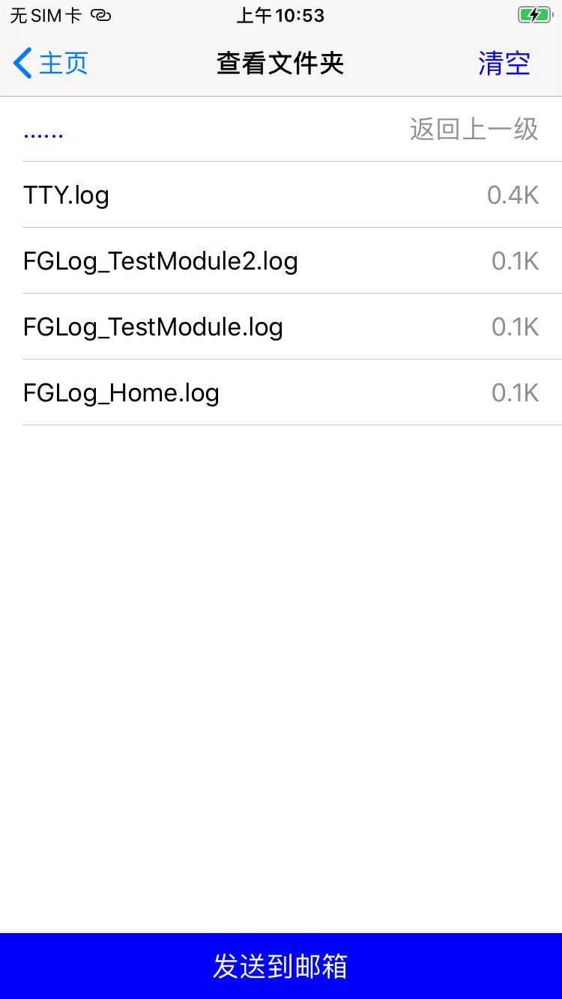

## 简书主页

[https://www.jianshu.com/u/9c7775326f88](https://www.jianshu.com/u/9c7775326f88)

## FGLogger

## A local logger for iOS.

在App开发中，本地日志对于测试分成重要，所以一个分模块的本地日志系统非常重要。

FGLogger 在根据模块枚举来区分模块，将不同模块的日志写入不同文件中，且一次启动活动的日志将被放入以启动时间命名的文件夹中，方便查找。应用结果如下：

<center class="third">
  
  
 </center>

  

## 结构

```shell
├── FGLog.h  //宏定义入口，使用FGLog(module,level,format,...)代替NSLog
├── FGLog.m
├── Application  //查看日志文件夹
│   ├── FGFileContext.h
│   ├── FGFileContext.m
│   ├── FGPrintFolderViewController.h
│   ├── FGPrintFolderViewController.m
│   ├── FGPrintLogViewController.h
│   └── FGPrintLogViewController.m
└── Logger     //日志写入模块
    ├── FGLoggerComponent.h  // 本地日志目录配置
    ├── FGLoggerComponent.m
    ├── FGLogger.h  //  本地日志写入基类，维护异步写入，日志文件循环覆盖，文件夹管理等
    ├── FGLogger.m
    ├── FGSingleRunLogger.h   //一次启动活动创建一个特定文件夹
    ├── FGSingleRunLogger.m
    ├── FGTTYLogger.h   //在一个文件夹中分模块写入日志
    └── FGTTYLogger.m
```


## FGLog

```objective-c
//定义的模块名，仅仅用来生成日志文件名，可随意定制
typedef NS_ENUM(NSInteger, FGLogModuleSign) {
    FGLog_UnclearModule,
    FGLog_Home,
    
};
// 日志输出等级
typedef NS_ENUM(NSInteger, FGLogLevel) {
    
    FGLogLevel_UnKnow = 0,
    FGLogLevel_Warning,
    FGLogLevel_MustShow,
    FGLogLevel_WriteToFile = FGLogLevel_MustShow, //写入文件中
};

//日志输出宏定义
#define FGLog(module,level,format,...) {[FGLogPrinter FGLogLevel:level Module:module ModuleStr:#module Function:__FUNCTION__ Thread:[NSThread currentThread] Line:__LINE__ Format:format Info:[NSString stringWithFormat:format,##__VA_ARGS__]];}

@interface FGLogPrinter : NSObject

+ (void)FGLogLevel:(NSInteger)level
            Module:(NSInteger)module
         ModuleStr:(const char* const)moduleStr
          Function:(const char* const)function
            Thread:(NSThread*)currentThread
              Line:(int)line
            Format:(NSString*)format
              Info:(NSString*)info;

@end
```


可根据需要重新定义自己的宏定义和日志输出级别。


## 应用方式

```objective-c
#import "ViewController.h"
#import "FGLog.h"
#import "FGPrintLogViewController.h"

//自定义模块，哪怕FGLog_TestModule与FGLog_Home值都为0也毫不影响。
typedef NS_ENUM(NSInteger, NewModuleSign) {
    FGLog_TestModule,
    FGLog_TestModule2,
};

@interface ViewController ()

@end

@implementation ViewController

- (void)viewDidLoad {
    [super viewDidLoad];
//     Do any additional setup after loading the view.
    self.title = @"主页";
    //调用输出日志
    FGLog(FGLog_Home, FGLogLevel_MustShow, @"已进入主页");
    FGLog(FGLog_TestModule, FGLogLevel_MustShow, @"新Module");
    FGLog(FGLog_TestModule2, FGLogLevel_MustShow, @"新Module2");
    
    {
        UIButton *btn = [[UIButton alloc]initWithFrame:CGRectMake(50, 100, 200, 44)];
        [btn setTitle:@"查看日志" forState:UIControlStateNormal];
        btn.backgroundColor = [UIColor blueColor];
        [btn addTarget:self action:@selector(pushToNextVC) forControlEvents:UIControlEventTouchUpInside];
        [self.view addSubview:btn];
    }

}

- (void)pushToNextVC{
    FGPrintLogViewController *vc = [[FGPrintLogViewController alloc]init];
    vc.view.backgroundColor = [UIColor whiteColor];
    [self.navigationController pushViewController:vc animated:YES];
}

@end
```

使用上述代码，即可生成对应模块日志。

注：自定义模块，哪怕FGLog_TestModule与FGLog_Home值都为0也毫不影响。


## Demo及Pod导入

Demo地址：[https://github.com/FlameGrace/FGLogger](https://github.com/FlameGrace/FGLogger)

```ruby
pod 'FGLogger'
```


